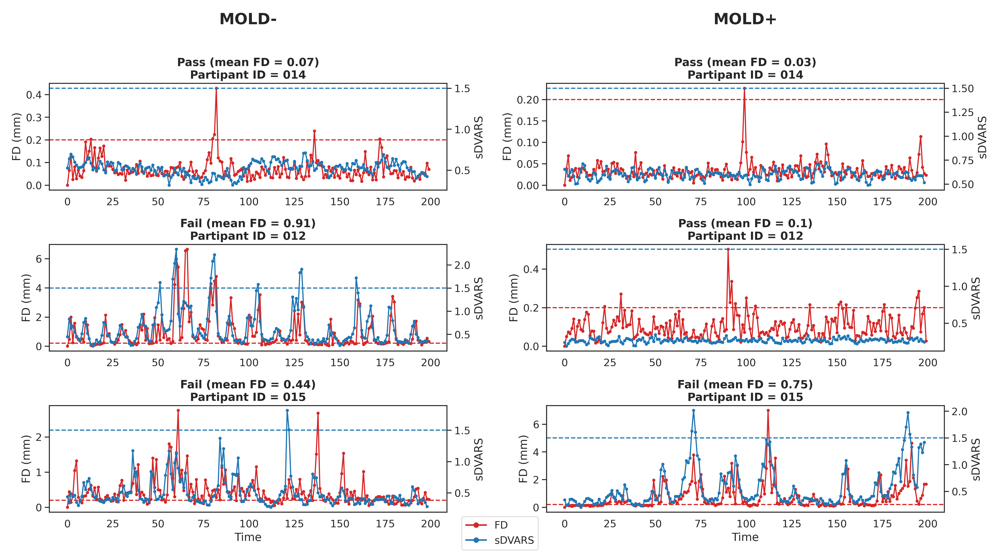
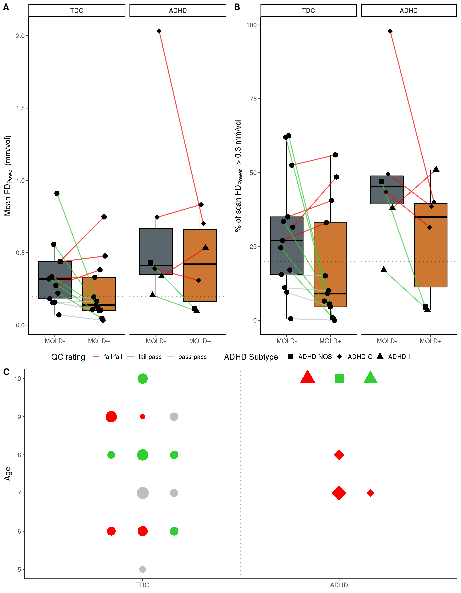
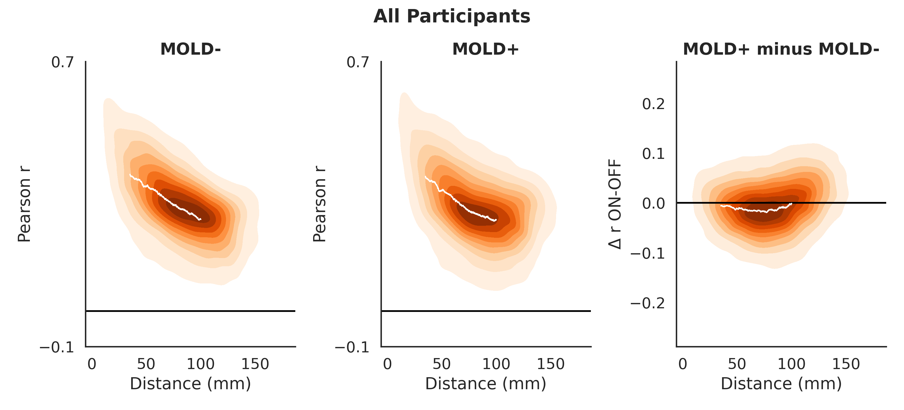
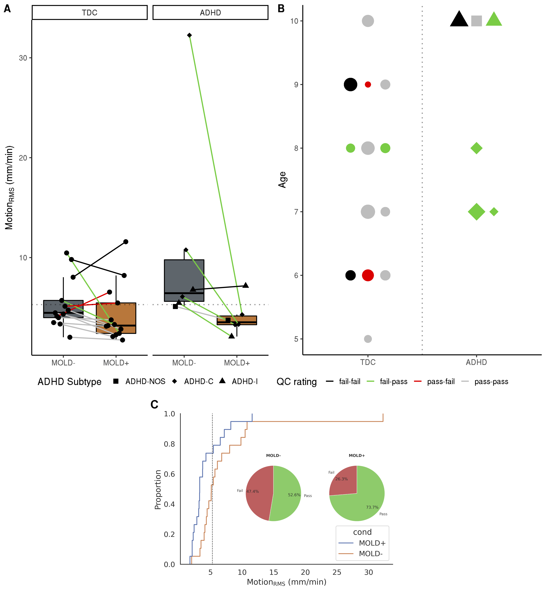
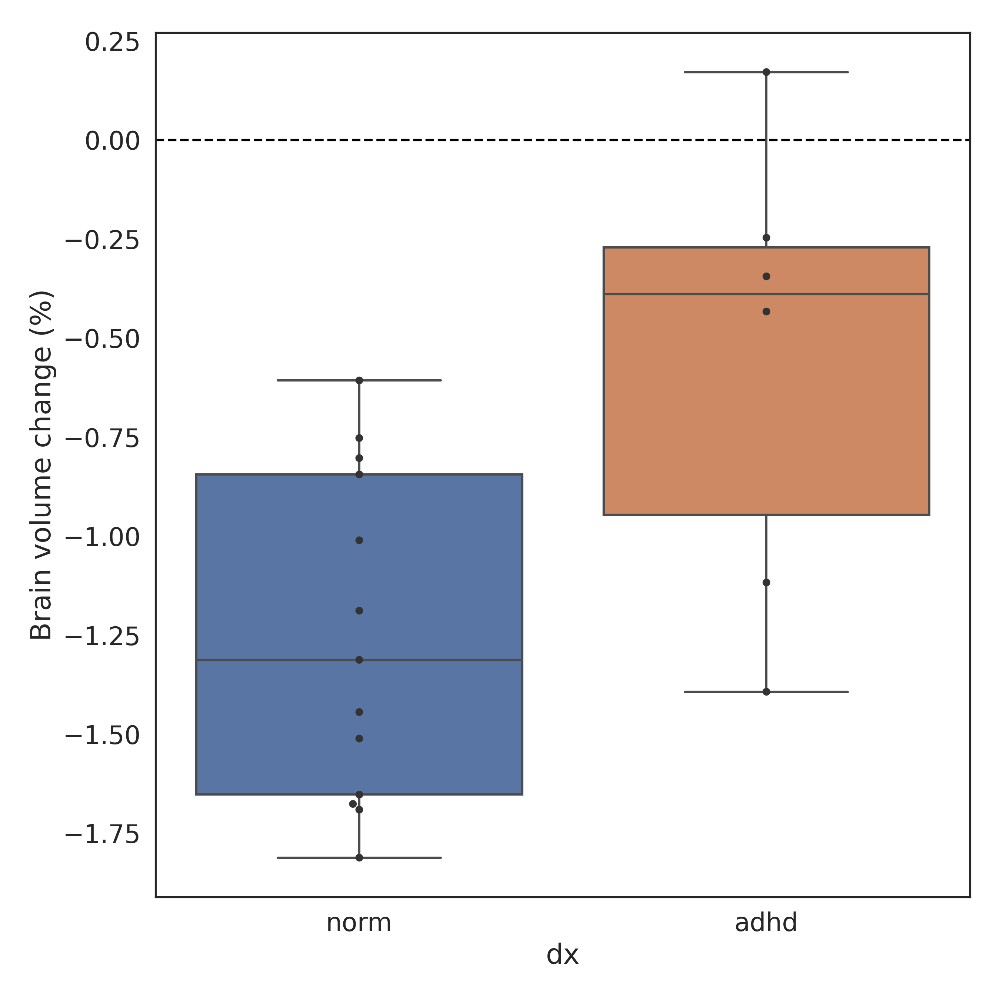
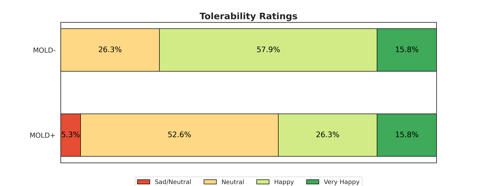
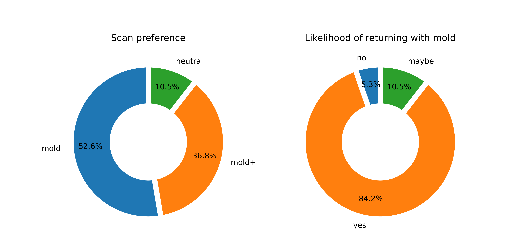

# The impact of customized head molds on motion and motion-related artifacts from structural and functional MRI scans in children

This is a repository containing the analyses for the paper entitled "The impact of customized head molds on motion and motion-related artifacts from structural and functional MRI scans in children". Analysis notebooks are: **`func_analysis.ipynb`**, **`struct_analyses.ipynb`**, and **`tolerability_analyses.ipynb`**.

Weng, T. B., Vela, R. D., Weber, W., Dodla, M., Heinsfeld, A. S., Parker, S. D., Simon, B., Demeter, D. V., Nugiel, T., Whitmore, L., Mills, K. L., Church, J. A., Haberman, M. R., & Craddock, R. C. (2021). The impact of customized head molds on motion and motion-related artifacts from structural and functional MRI scans in children. MedRxiv, 2021.03.24.21253213. https://doi.org/10.1101/2021.03.24.21253213

**Tools**: *Pandas, NumPy, scikit-learn, SciPy, Seaborn, Matplotlib, [NiBabel](https://nipy.org/nibabel/), [Nilearn](https://nilearn.github.io/)*

## Abstract
Although neuroimaging provides powerful tools for assessing brain structure and function, their utility for elucidating mechanisms underlying neuropsychiatric disorders is limited by their sensitivity to head motion. Several publications have shown that standard retrospective motion correction and arduous quality assessment are insufficient to fully remove the deleterious impacts of motion on functional (fMRI) and structural (sMRI) neuroimaging data. These residual errors tend to be correlated with age and clinical diagnosis, resulting in artifactual findings in studies of clinical, developmental, and aging populations. As such there is a continued need to explore and evaluate novel methods for reducing head motion, and their applicability in these populations. Recently, a custom-fitted styrofoam head mold was reported to reduce motion across a range of ages, mostly adolescents, during a resting state fMRI scan.

In the present study, we tested the efficacy of these head molds in a sample exclusively of young children (N = 19; mean age = 7.9 years) including those with ADHD (N = 6). We evaluated the head mold’s impact on head motion, data quality, and analysis results derived from the data. Importantly, we also evaluated whether the head molds were tolerated by our population. We also assessed the extent to which the head mold’s efficacy was related to anxiety levels and ADHD symptoms. In addition to fMRI, we examined the head mold’s impact on sMRI by using a specialized sequence with embedded volumetric navigators (vNAV) to determine head motion during sMRI. We evaluated the head mold’s impact on head motion, data quality, and analysis results derived from the data. Additionally, we conducted acoustic measurements and analyses to determine the extent to which the head mold reduced the noise dosage from the scanner. We found that some individuals benefited while others did not improve significantly. One individual’s sMRI motion was made worse by the head mold. We were unable to identify predictors of the head mold response due to the smaller sample size. The head molds were tolerated well by young children, including those with ADHD, and they provided ample hearing protection. Although the head mold was not a universal solution for reducing head motion and improving data quality, we believe the time and cost required for using the head mold may outweigh the potential loss of data from excessive head motion for developmental studies.

## Analysis Plan

**Functional MRI Analyses**

- Does head motion differ between with and without the head mold?

- Does scan quality differ between with and without the head mold?

- Does the head mold reduce distance-dependent artifacts in functional connectivity analyses?

**Structural MRI Analyses**

- Does head motion differ between with and without the head mold?

- Does scan quality differ between with and without the head mold?

- Do volumetric estimates differ between head mold conditions?

**Behavioral Analyses**

- Do participants' tolerability ratings differ between with and without the head mold?

- Do the head molds affect the likelihood of returning for another MRI scan?

- Did participants prefer the MRI scan with or without the head mold?

